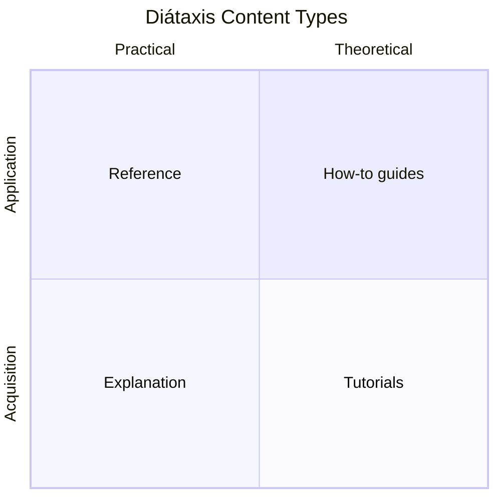

# Documentation Methodology

Every page on this site is built on two industry-standard frameworks. Together, they answer the two hardest questions in technical writing:

| Framework | Answers the question |
|-----------|---------------------|
| [Google Developer Documentation Style Guide](https://developers.google.com/style) | "How should this sentence read?" |
| [Diátaxis Framework](https://diataxis.fr/) | "Where should this content live?" |

Style without structure produces beautiful prose nobody can navigate. Structure without style produces clean architecture full of unreadable pages. You need both.

:::info About this page
I'm **Leandro Gabriel** — a Technical Writer with 7+ years applying these frameworks at scale across fintech (Itaú/PIX), enterprise retail (Sephora LATAM), healthcare (Infomed Benner), and cybersecurity. This page is both an explanation of the frameworks and a record of my specialization in them.
:::

---

## Google Developer Documentation Style Guide

### What it is

The [Google Developer Documentation Style Guide](https://developers.google.com/style) is the public, openly-licensed style guide used by Google's developer documentation teams. It's the de-facto standard for modern API and developer docs because it solves a specific problem: *how do you write technical content that's clear to a non-native English speaker, accessible to a screen reader, and unambiguous to a developer skimming for a code sample?*

### Core principles

- **Conversational but precise.** Write like a knowledgeable colleague — never condescending, never academic.
- **Active voice, present tense, second person.** "The API returns a token" — not "A token will be returned by the API."
- **Sentence case everywhere.** Headings, button labels, UI strings. "Manage your usage" — not "Manage Your Usage".
- **No filler words.** "Just", "simply", "obviously", "easily", "please" — banned. They assume the reader's experience or condescend.
- **"Can", not "may".** Reserve "may" for permission. Use "can" for ability.
- **Spell out Latin abbreviations.** "for example", not "e.g."; "that is", not "i.e."
- **Realistic examples.** No `foo`, `bar`, `baz`. Use values that look like real data.

### Why it works at scale

Google's style guide is opinionated where it matters and silent where it shouldn't be. It removes hundreds of micro-decisions from every writing session — capitalization, voice, comma usage, list formatting — so writers spend their time on accuracy, not bikeshedding.

In a docs-as-code workflow, a public style guide also doubles as a review reference. PR comments can cite specific sections instead of devolving into taste arguments.

### How I apply it in this portfolio

Open any page on this site and you'll find:

- **Sentence-case headings** — see [Integration Guide](/docs/integration-guide), [Hardware Install Guide](/docs/energy-bridge/energy-bridge-installation-guide-atlas-insight).
- **Imperative-mood instructions** in tutorials and how-to guides — "Click Connect", not "You should click Connect".
- **Realistic API examples** — every payload in the [API Reference](/docs/api/powerbox-api) uses field names and values that map to a believable utility data model.
- **Banned-word audits** baked into the [Writing Guideline](/docs/writing-guideline#72-words-to-avoid).

---

## Diátaxis Framework

### What it is

[Diátaxis](https://diataxis.fr/) is a documentation taxonomy created by Daniele Procida (formerly of Divio, now Canonical). It splits all technical documentation into exactly **four content types**, each with a distinct purpose, audience mindset, and writing style.

| Type | Purpose | User mindset | What it must do |
|------|---------|--------------|-----------------|
| **Tutorial** | Learning by doing | "I'm new. Teach me." | Guarantee a successful outcome. Be a lesson, not a lecture. |
| **How-to guide** | Goal-oriented steps | "I know what I'm doing. Show me the steps." | Solve a real problem. Skip the basics. |
| **Reference** | Information lookup | "I need a fact." | Be accurate, exhaustive, and dry. No story. |
| **Explanation** | Conceptual understanding | "Help me make sense of this." | Discuss, compare, give context. Can branch into trade-offs. |

### The rule that breaks most docs

**Each page must be exactly one type.** This is the rule that gets violated most often, and it's why so much documentation is frustrating to read.

When a page tries to be both a tutorial and a reference, the new user gets buried in details and the experienced user has to wade through hand-holding. When a how-to guide drifts into explanation, the reader who wants the steps has to skim through paragraphs of context.

Diátaxis fixes this by giving you a vocabulary to ask: *"What is this page actually for?"*

### How I apply it in this portfolio

The site's information architecture maps directly onto Diátaxis:

| This site's page | Diátaxis type | Why |
|------------------|---------------|-----|
| [Integration Guide](/docs/integration-guide) | **Explanation** + structured **how-to** | Architecture sections explain *why*; step sections show *how* — clearly separated |
| [API Reference](/docs/api/powerbox-api) | **Reference** | Auto-generated from OpenAPI; no opinions, no narrative |
| [Hardware Install Guide](/docs/energy-bridge/energy-bridge-installation-guide-atlas-insight) | **How-to guide** | Assumes the reader has the hardware in hand and wants the steps |
| [Data Dictionary](/docs/data-dictionary) | **Reference** | Look-up table of fields and storage locations |
| [BillSense AI](/docs/billwise-ai/overview) | **Explanation** + **how-to** | Concept page separated from troubleshooting steps |
| [Writing Guideline](/docs/writing-guideline) | **Reference** | Look-up rules, not a tutorial on how to write |

If you spot a page that violates the one-type rule, it's a bug. Open an issue.

---

## Why these two together

Style guides and content frameworks solve different problems. Most documentation projects pick one and ignore the other:

- **Style-only orgs** produce beautifully-written content that's impossible to navigate. Every page reads well in isolation but the IA is a maze.
- **Structure-only orgs** produce well-organized content that's painful to read line-by-line. The taxonomy is correct, but the prose is academic, passive, and full of "may" and "please".

Pairing **Google's style guide** (sentence-level rules) with **Diátaxis** (page-level taxonomy) closes the gap. You get answers to:

- Word level: which word? → Google
- Sentence level: active or passive? → Google
- Page level: tutorial or reference? → Diátaxis
- Site level: where does this belong? → Diátaxis

The result is documentation that's both *readable line-by-line* and *navigable as a whole*.

---

## My specialization

### Track record

| Where | What I built |
|-------|--------------|
| **Sephora LATAM** (via Amaris Consulting, 2024–present) | Restructured enterprise documentation around Diátaxis content types, reducing rework by 75% and accelerating onboarding by 40%. Aligned voice and tone with Google-style conventions across compliance manuals and process flows. |
| **Itaú Unibanco** (via Zup Innovation, 2022–2024) | Authored API documentation and integration guides for the PIX payment system using Google-style conventions and Diátaxis content separation. Drove developer-doc satisfaction from 3.8 → 4.6 / 5 in six months. |
| **Infomed Benner** (2021–2022) | Healthcare documentation using strict reference-vs-how-to separation; cut recurring support tickets by 25% via better information architecture. |
| **EnergyGrid Portfolio** (this site) | A reference implementation showing how Google + Diátaxis apply across six audience types: developers, integrators, field technicians, end users, support agents, and AI-tool operators. |

### What "specialist" means in practice

I don't just *know* these frameworks — I've migrated organizations onto them. That work involves:

- **Auditing existing docs against Diátaxis** to find pages that try to be two things at once, and proposing splits.
- **Writing style-guide adoption playbooks** that work for technical writers, engineers, and product managers — each of whom needs different on-ramps.
- **Building docs-as-code review workflows** where Google-style violations and Diátaxis-type violations are caught in PR review, not after publication.
- **Training engineering teams** to write reference docs that don't drift into tutorial, and tutorials that don't drift into reference.

If you're rebuilding a documentation system and want both the sentence-level polish and the page-level structure right, this is what I do. [Get in touch.](https://www.linkedin.com/in/leandro-gabriel-8aab31167/)

---

## Further reading

- [Google Developer Documentation Style Guide](https://developers.google.com/style) — the full style guide
- [Diátaxis](https://diataxis.fr/) — the framework, with detailed essays on each content type
- [Writing Guideline](/docs/writing-guideline) — this site's applied style guide, derived from both
- [The Documentation System (Daniele Procida's original talk)](https://documentation.divio.com/) — the predecessor to Diátaxis
