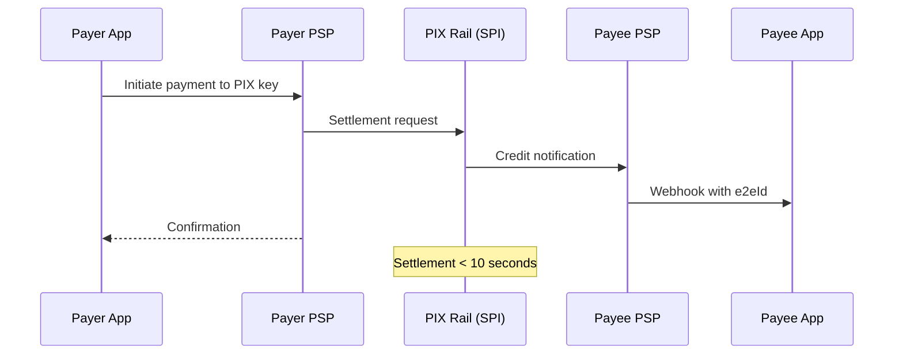
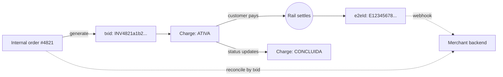

# About PIX

PIX is the instant-payments rail operated by [Banco Central do Brasil](https://www.bcb.gov.br/en/financialstability/pix_en) (BCB). It moves money between any two accounts in Brazil — across more than 800 participating institutions — in under 10 seconds, 24 hours a day, every day of the year, including holidays.

This page explains what that means for anyone who has to design, document, or integrate against the rail. It does not teach you how to use any specific API. For that, see [Send your first PIX payment](./tutorial-first-payment).

## Why PIX exists

Before 2020, moving money between Brazilian banks took business hours and at least one banking day. Inter-bank wires (`TED`) settled twice a day. Direct debits (`DOC`) settled the next business day. Cash and card-rail intermediation made up the rest.

PIX replaces that whole layer with a single rail that:

- Settles in real time, end-to-end, between any two accounts.
- Operates 24/7/365.
- Costs the receiving bank near-zero (free for individuals; capped for businesses).
- Uses human-friendly identifiers (a phone number, an email, a tax ID) instead of branch and account numbers.

It went live in November 2020 and crossed [1 billion transactions per month](https://www.bcb.gov.br/en/financialstability/pix_en) inside its first year. It is the largest instant-payments deployment in the world by volume.

## The two roles every integrator plays

Every PIX integration sits between two parties:

- The **payer** — the customer initiating the payment.
- The **payee** — the merchant or recipient receiving it.

Each party has an account at a bank or fintech licensed by BCB. Those institutions are called **PSPs** (Payment Service Providers). PSPs are the only entities that talk directly to the rail; everyone else integrates through a PSP's API.



Two messages cross the rail per payment. One asks for settlement; one confirms it. The whole round trip is faster than a cup of coffee.

## What you actually integrate against

When a developer says "integrating PIX," they usually mean integrating against a PSP's PSP API — not the rail itself. The rail is a [BCB-operated message bus](https://www.bcb.gov.br/estabilidadefinanceira/pix) that only licensed institutions can join. The PSP API is what banks expose to merchants and fintechs on top of the rail.

The publicly-documented [PSP API standard](https://bacen.github.io/pix-api/) defines a small surface:

| Resource | Purpose |
| --- | --- |
| `cob` | An immediate charge — a payment intent the merchant generates and the customer settles. |
| `cobv` | A scheduled charge with a due date and optional fees, interest, and discount. |
| `pix` | A received PIX, addressable by `e2eId`. |
| `webhook` | A URL the PSP posts to when a payment settles for a given key. |
| `lote` | A batch of charges (`cobs`) for high-volume merchants. |

The [Instant Payments API sample](/docs/api/pix-api/instant-payments-api-pix-sample) covers a focused subset of this surface — enough to issue, fetch, and reconcile a payment end-to-end.

## PIX keys

A **PIX key** (`chave`) is a human-readable handle that resolves to a bank account. There are five types, and the type matters because it constrains who can register the key and how the payer-facing UX renders.

| Type | Format | Who can register | UX cue |
| --- | --- | --- | --- |
| **CPF** | 11 digits | The natural person who owns the CPF | Tax ID, masked (e.g. `***.456.789-**`) |
| **CNPJ** | 14 digits | The legal entity that owns the CNPJ | Tax ID, full |
| **Email** | RFC 5322 | Anyone, after email verification | Lowercase, no display masking |
| **Phone** | E.164, prefixed `+55` | Anyone, after SMS verification | International format |
| **EVP** | Random UUID-like string issued by the PSP | Anyone | Treated as opaque; never displayed prominently |

A key is **resolved** through DICT (the Directory of Identifiers, operated by BCB). When a payer types a key into their app, the payer's PSP queries DICT to learn which PSP holds the key — and therefore where to route the payment.

Every account can hold up to five keys (CPF/CNPJ-bearer accounts can hold ten). A key cannot be shared across accounts.

### Why the EVP exists

The EVP — *chave aleatória* — is a privacy primitive. Customers who don't want their phone, email, or tax ID associated with their account use an EVP instead. The trade-off is that an EVP is harder to share verbally and impossible to memorize. Wallets render it as a copy-and-paste string or as a QR code.

## End-to-end ID

Every settled payment carries an **end-to-end ID** (`e2eId`) issued by the rail at settlement. The format is fixed:

```
E + ISPB(8) + YYYYMMDDHHMM + suffix(11)
```

| Segment | Meaning |
| --- | --- |
| `E` | Literal prefix |
| `ISPB` | The receiving PSP's 8-digit identifier in the BCB system |
| `YYYYMMDDHHMM` | UTC settlement timestamp at minute resolution |
| `suffix` | 11-character alphanumeric, unique within the minute |

The `e2eId` is the canonical identifier for reconciliation. Every webhook, every refund request, and every audit trail anchors on it. If you only persist one field about a PIX payment, persist the `e2eId`.

## Charges and the `txid`

A `cob` (charge) is a payment intent. The merchant creates it; the rail does not know about it until the customer pays. Every charge carries a `txid` — a caller-supplied transaction ID, 26 to 35 alphanumeric characters, unique within the PSP for at least 365 days.

The relationship is:

- One `txid` → at most one charge → at most one settled `e2eId`.
- One `e2eId` → at most one `txid` (can be empty for direct PIX without a charge).

The `txid` is what merchants use to correlate a charge with their internal order. The `e2eId` is what the rail uses to correlate a payment with itself.



## What "instant" actually means

The 10-second SLA is end-to-end: from the moment the payer's PSP sends the settlement request to the moment the payee's PSP confirms the credit. In practice, the inter-bank leg takes well under one second — the rest is the PSPs' internal processing.

A few consequences:

- **No reversal window.** Once settled, a PIX payment cannot be unwound. Refunds (`devolução`) are new payments on the rail, not undo operations.
- **Webhooks are the source of truth, not API polling.** A merchant that polls `GET /cob/{txid}` will see the charge transition from `ATIVA` to `CONCLUIDA` within seconds, but the webhook arrives faster and includes the full payment context.
- **Idempotency matters at the rail boundary.** The rail will not deliver the same `e2eId` twice. The PSP webhook layer might. Merchants that double-credit because of a redelivered webhook owe a refund — which is itself a new PIX.

## Where API design choices come from

A few design conventions in the public PIX standard look unusual to people coming from a Stripe-style API:

- **The merchant supplies the `txid`, not the server.** This lets merchants generate idempotency tokens before they have a network round-trip — useful for offline-first POS systems.
- **`PUT` creates, `PATCH` updates.** A `PUT /cob/{txid}` with an existing txid returns 409 unless the body matches exactly (idempotent re-create). This is opposite to most CRUD conventions but matches the rail's at-least-once guarantee.
- **Amounts are strings, not numbers.** `"valor": { "original": "150.00" }`. JSON has no decimal type; floats drift; the spec ducks the problem by not letting clients use them.
- **Field names are in Portuguese.** `cob`, `chave`, `devedor`, `valor`, `solicitacaoPagador`. The rail is national infrastructure and the spec was written for a Portuguese-speaking integrator audience first.

These are not arbitrary. Each one removes a class of bug that would otherwise show up in production at high volume.

## Further reading

- [Banco Central do Brasil — PIX overview (English)](https://www.bcb.gov.br/en/financialstability/pix_en)
- [PIX PSP API standard (Portuguese)](https://bacen.github.io/pix-api/) — the public OpenAPI spec the sample on this site is based on
- [Manual de Uso do BR Code](https://www.bcb.gov.br/estabilidadefinanceira/spb_pix) — QR-code payload format used in PIX charges
- [Send your first PIX payment](./tutorial-first-payment) — guided walkthrough of the sandbox flow
- [Handle PIX webhook callbacks](./how-to-handle-webhooks) — how to set up the webhook listener
- [Instant Payments API reference](/docs/api/pix-api/instant-payments-api-pix-sample) — the OpenAPI sample for this section
