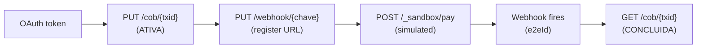

# Send your first PIX payment

This tutorial walks you from zero to a confirmed PIX payment in the sandbox of the [Instant Payments API sample](/docs/api/pix-api/instant-payments-api-pix-sample). By the end, you will have:

- A sandbox client ID and secret
- A registered PIX key
- A webhook endpoint that receives payment notifications
- One settled payment with an `e2eId`

The tutorial uses cURL and a small Node.js script for the webhook. You can swap either for your language of choice.

If you would rather understand what PIX *is* before writing any code, read [About PIX](./about-pix) first.

## Prerequisites

- Node.js 20+ and `curl` installed locally
- An ngrok account ([free tier is enough](https://ngrok.com/))
- A scratch folder for the tutorial:

    ```bash
    mkdir pix-tutorial && cd pix-tutorial
    ```

The sandbox does not move real money. You can re-run every step as many times as you want.

## Step 1 — Get a sandbox token

1. **Request sandbox credentials**

    Sandbox accounts on this sample API are issued on demand. Request a `client_id` and `client_secret` by emailing `pix-sandbox@instant-payments.example` with the subject `Sandbox access`. You receive credentials within one business hour.

    > **Note:** This API is a portfolio sample — the credentials flow above is illustrative. The script in [Step 2](#step-2--create-a-charge) shows the OAuth call you would actually make against a real PSP.

2. **Export the credentials**

    ```bash
    export PIX_CLIENT_ID=<your-id>
    export PIX_CLIENT_SECRET=<your-secret>
    export PIX_BASE_URL=https://sandbox.instant-payments.example/v2
    ```

3. **Get an access token**

    PIX PSPs use OAuth 2.0 client credentials. The token is short-lived (typically one hour).

    ```bash
    PIX_TOKEN=$(curl -sS -X POST \
      "${PIX_BASE_URL%/v2}/oauth/token" \
      -u "$PIX_CLIENT_ID:$PIX_CLIENT_SECRET" \
      -d "grant_type=client_credentials&scope=cob.write cob.read pix.read webhook.write" \
      | jq -r .access_token)

    echo "Token: ${PIX_TOKEN:0:12}…"
    ```

    Expected output:

    ```text
    Token: eyJhbGciOiJ…
    ```

    > **Tip:** If `jq` is not on your machine, install it (`brew install jq`, `apt install jq`) — every step below uses it to parse JSON responses.

## Step 2 — Create a charge

A `cob` (charge) is a payment intent that the customer settles. The merchant supplies the `txid`. Pick something memorable but unique:

1. **Generate a transaction ID**

    ```bash
    export TXID=tutorial$(date +%Y%m%d%H%M%S)$(openssl rand -hex 4)
    echo "txid: $TXID (length ${#TXID})"
    ```

    The `txid` must be 26 to 35 alphanumeric characters. The line above produces 30.

2. **Create the charge**

    ```bash
    curl -sS -X PUT \
      "$PIX_BASE_URL/cob/$TXID" \
      -H "Authorization: Bearer $PIX_TOKEN" \
      -H "Content-Type: application/json" \
      -d '{
        "calendario": { "expiracao": 3600 },
        "valor": { "original": "12.50" },
        "chave": "merchant@example.com",
        "solicitacaoPagador": "Tutorial run"
      }' | tee charge.json | jq .status
    ```

    Expected output:

    ```text
    "ATIVA"
    ```

    The full response is now in `charge.json`. The fields you care about for later steps are `txid`, `revisao`, and `loc.id` (the QR code reference).

> **Note:** The `chave` (`merchant@example.com`) is a sandbox key pre-registered to your client. In production you would register your own key first — see the [API reference](/docs/api/pix-api/instant-payments-api-pix-sample) for the `PUT /webhook/{chave}` flow.

## Step 3 — Stand up a webhook listener

The sandbox simulates a paying customer for you. Before triggering the simulated payment, expose an HTTPS endpoint that the PSP can post to.

1. **Write a minimal listener**

    Create `webhook.js`:

    ```javascript
    const http = require('http');

    const port = 3000;

    http.createServer((req, res) => {
      let body = '';
      req.on('data', (chunk) => (body += chunk));
      req.on('end', () => {
        console.log(`\n${new Date().toISOString()}  ${req.method} ${req.url}`);
        try {
          const payload = JSON.parse(body);
          console.log(JSON.stringify(payload, null, 2));
        } catch {
          console.log(body || '(empty body)');
        }
        res.writeHead(200, { 'Content-Type': 'application/json' });
        res.end('{"received":true}');
      });
    }).listen(port, () => {
      console.log(`Webhook listener on http://localhost:${port}`);
    });
    ```

    Run it in a terminal:

    ```bash
    node webhook.js
    ```

2. **Expose it with ngrok**

    In a second terminal:

    ```bash
    ngrok http 3000
    ```

    Expected output:

    ```text
    Forwarding  https://a1b2c3.ngrok.io -> http://localhost:3000
    ```

    Copy the HTTPS URL — you'll register it next.

3. **Register the webhook**

    ```bash
    export NGROK_URL=https://a1b2c3.ngrok.io   # paste your URL here

    curl -sS -X PUT \
      "$PIX_BASE_URL/webhook/merchant@example.com" \
      -H "Authorization: Bearer $PIX_TOKEN" \
      -H "Content-Type: application/json" \
      -d "{ \"webhookUrl\": \"$NGROK_URL/pix-callback\" }" | jq
    ```

    Expected output:

    ```json
    {
      "webhookUrl": "https://a1b2c3.ngrok.io/pix-callback",
      "chave": "merchant@example.com",
      "criacao": "2026-04-24T18:32:11Z"
    }
    ```

    A key has at most one webhook. Re-running this command replaces the URL.

## Step 4 — Trigger a sandbox payment

In production, the customer scans the charge's QR code with their banking app. The sandbox exposes a helper that simulates that step.

1. **Send the simulated payment**

    ```bash
    curl -sS -X POST \
      "$PIX_BASE_URL/_sandbox/pay/$TXID" \
      -H "Authorization: Bearer $PIX_TOKEN" \
      -H "Content-Type: application/json" \
      -d '{
        "pagador": { "cpf": "12345678909", "nome": "João Tutorial" }
      }' | jq .endToEndId
    ```

    Expected output:

    ```text
    "E12345678202604241832A1B2C3D4E5F"
    ```

2. **Watch the webhook fire**

    In the terminal running `webhook.js`, you should see the callback within a few seconds:

    ```text
    2026-04-24T18:32:14.221Z  POST /pix-callback
    {
      "endToEndId": "E12345678202604241832A1B2C3D4E5F",
      "txid": "tutorial20260424183205a1b2c3d4",
      "valor": "12.50",
      "horario": "2026-04-24T18:32:13Z",
      "pagador": {
        "cpf": "12345678909",
        "nome": "João Tutorial"
      }
    }
    ```

    > **Important:** Always respond `2xx` from the webhook within 5 seconds. The PSP retries with exponential backoff for up to 24 hours on non-2xx responses, which can flood your endpoint during an outage.

## Step 5 — Reconcile

The webhook is your source of truth. The API is your verification path.

1. **Refresh the charge**

    ```bash
    curl -sS \
      "$PIX_BASE_URL/cob/$TXID" \
      -H "Authorization: Bearer $PIX_TOKEN" | jq '{ status, pix: .pix[0].endToEndId }'
    ```

    Expected output:

    ```json
    {
      "status": "CONCLUIDA",
      "pix": "E12345678202604241832A1B2C3D4E5F"
    }
    ```

    The `txid` and the `e2eId` now point at each other. Either one resolves the full payment.

2. **Look up the received PIX directly**

    ```bash
    curl -sS \
      "$PIX_BASE_URL/pix/E12345678202604241832A1B2C3D4E5F" \
      -H "Authorization: Bearer $PIX_TOKEN" | jq
    ```

    Expected output:

    ```json
    {
      "endToEndId": "E12345678202604241832A1B2C3D4E5F",
      "txid": "tutorial20260424183205a1b2c3d4",
      "valor": "12.50",
      "horario": "2026-04-24T18:32:13Z",
      "pagador": {
        "cpf": "12345678909",
        "nome": "João Tutorial"
      }
    }
    ```

You have just settled a payment, received a webhook, and reconciled both sides. That's the entire happy path.

## What you built



Five HTTP calls. One settled payment. The same shape works at production volume — the only thing that scales is the webhook listener.

## Where to go next

- [Handle PIX webhook callbacks](./how-to-handle-webhooks) — production-ready webhook handling: signature verification, idempotency, replay safety.
- [About PIX](./about-pix) — the rail, the keys, the `e2eId`, and why API choices look the way they do.
- [Instant Payments API reference](/docs/api/pix-api/instant-payments-api-pix-sample) — the full OpenAPI surface.

## Troubleshooting

| Problem | Cause | Fix |
| --- | --- | --- |
| `401` on `/oauth/token` | Wrong `client_id` or `client_secret` | Re-export the env vars; check for trailing whitespace. |
| `400` on `PUT /cob/{txid}` with `propriedade: "valor.original"` | Amount sent as a number, not a string | Wrap the amount in quotes: `"original": "12.50"`. |
| `409` on `PUT /cob/{txid}` | Re-using a `txid` with a different body | Generate a fresh `txid` (Step 2.1) or re-send the same body for an idempotent re-create. |
| Webhook doesn't fire | ngrok URL changed since last registration | Re-run `PUT /webhook/{chave}` with the current ngrok URL. |
| Webhook receives the same `e2eId` twice | The PSP retried because the listener didn't return `2xx` quickly enough | Persist `e2eId` and dedupe — see [Handle webhook callbacks](./how-to-handle-webhooks#guarantee-idempotency). |
