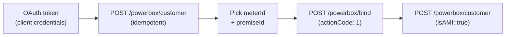

# Your first EnergyGrid integration in 30 minutes

This tutorial walks you from zero to a working EnergyGrid integration in the [PowerBox API](/docs/api/powerbox-api) sandbox. By the end, you will have:

- A sandbox `client_id` and `client_secret` issued by the utility identity provider.
- A short-lived OAuth Bearer token.
- A synchronised customer with one premise, one meter, and a verifiable `clientId`.
- A DataBridge device bound to that meter.

The tutorial uses cURL and `jq` so you can copy-paste each command. You can swap them for any HTTP client of your choice.

If you would rather understand what the PowerBox API *is* before writing any code, read the [Integration Guide](/docs/integration-guide) first.

## Prerequisites

- A terminal with `curl` and `jq` installed.
- Roughly thirty minutes of focused time.
- A scratch folder for the tutorial:

    ```bash
    mkdir energygrid-tutorial && cd energygrid-tutorial
    ```

The PowerBox sandbox does not move real customer data and does not actually pair a physical device. You can re-run every step as many times as you want — customer sync is idempotent on `clientId`, and binding a meter that is already bound returns a no-op.

## Step 1 — Get sandbox credentials

EnergyGrid does not issue tokens directly. The utility identity provider (IDP) does. For this tutorial you can use the synthetic IDP that ships with the staging environment.

1. **Request sandbox credentials**

    Sandbox accounts on this sample API are issued on demand. Request a `client_id` and `client_secret` by emailing `powerbox-sandbox@energygrid.example` with the subject `Sandbox access`. You receive credentials within one business hour.

    > **Note:** This API is a portfolio sample — the credentials flow above is illustrative. The script in [Step 2](#step-2--get-an-access-token) shows the OAuth call you would actually make against a real utility IDP.

2. **Export the credentials**

    ```bash
    export ENERGY_CLIENT_ID=<your-id>
    export ENERGY_CLIENT_SECRET=<your-secret>
    export ENERGY_BASE_URL=https://staging.api.energygrid.example/v1
    export ENERGY_IDP_URL=https://idp.staging.energygrid.example
    ```

    The base URL points at the **staging** environment. Production lives at `https://api.energygrid.example/v1` and is read-only to your sandbox client.

## Step 2 — Get an access token

Utility partners use OAuth 2.0 with OpenID Connect. For the back-office flows in this tutorial — customer sync and hardware binding — the right grant is **client credentials**. The token is short-lived (typically one hour). I'll explain why utility-customer flows use a different grant in the [Integration Guide](/docs/integration-guide#step-2-configure-authentication-oauth).

1. **Request the token**

    ```bash
    ENERGY_TOKEN=$(curl -sS -X POST \
      "$ENERGY_IDP_URL/oauth/token" \
      -u "$ENERGY_CLIENT_ID:$ENERGY_CLIENT_SECRET" \
      -d "grant_type=client_credentials&scope=customer.sync hardware.bind" \
      | jq -r .access_token)

    echo "Token: ${ENERGY_TOKEN:0:12}…"
    ```

    Expected output:

    ```text
    Token: eyJhbGciOiJ…
    ```

    > **Tip:** If `jq` is not on your machine, install it (`brew install jq`, `apt install jq`) — every step below uses it to parse JSON responses.

2. **Confirm the token works**

    ```bash
    curl -sS -o /dev/null -w "%{http_code}\n" \
      "$ENERGY_BASE_URL/powerbox/healthz" \
      -H "Authorization: Bearer $ENERGY_TOKEN"
    ```

    Expected output:

    ```text
    200
    ```

    A `401` here means the token didn't make it through — re-export `ENERGY_TOKEN` and try again.

## Step 3 — Synchronise a customer

The first real call pulls a customer profile from the utility's Customer Information System (CIS) into EnergyGrid: the account, the service addresses (Premises), and the meter configurations attached to each. The same call also confirms that EnergyGrid can read your CIS — it's the integration health check the rest of the tutorial depends on.

1. **Trigger the sync**

    ```bash
    curl -sS -X POST \
      "$ENERGY_BASE_URL/powerbox/customer" \
      -H "Authorization: Bearer $ENERGY_TOKEN" \
      -H "Content-Type: application/json" \
      | tee customer.json | jq '{ clientId, AcctStatus, sites: (.customerSites | length) }'
    ```

    Expected output:

    ```json
    {
      "clientId": "123456789",
      "AcctStatus": "A",
      "sites": 1
    }
    ```

    The full CIS payload is now saved to `customer.json`. `AcctStatus = "A"` means the account is active. `sites: 1` confirms exactly one premise is associated with the customer — the test fixture used by the sandbox.

2. **Pick the meter you'll bind**

    Each premise can carry multiple meters (electric, gas). You only need one for the tutorial — extract the first electric meter:

    ```bash
    export METER_ID=$(jq -r '.customerSites[0].meters[] | select(.meterType=="Electric") | .meterId' customer.json | head -n1)
    export PREMISE_ID=$(jq -r '.customerSites[0].externalSiteId' customer.json)

    echo "Premise: $PREMISE_ID"
    echo "Meter:   $METER_ID"
    ```

    Expected output:

    ```text
    Premise: 5113305555
    Meter:   123456789
    ```

    Hold these IDs for the next step.

> **Note:** Customer sync is idempotent on `clientId`. Re-running this command does not duplicate data — EnergyGrid uses the response to refresh its mirror, not to insert. You can re-export the meter and premise IDs at any point if your shell forgets them.

## Step 4 — Bind a DataBridge device

Now link a DataBridge device to the meter you picked in Step 3. In production the customer scans a QR code on the DataBridge during install, and the utility's wireless mesh radio (Home Area Network) handles pairing. The sandbox accepts hardcoded values that simulate the same handshake.

1. **Send the bind request**

    ```bash
    export HEM_PROFILE_ID=$(jq -r '.clientId' customer.json)

    curl -sS -X POST \
      "$ENERGY_BASE_URL/powerbox/bind" \
      -H "Authorization: Bearer $ENERGY_TOKEN" \
      -H "Content-Type: application/json" \
      -d "{
        \"hemProfileId\": \"$HEM_PROFILE_ID\",
        \"macAddress\": \"AA:BB:CC:DD:EE:FF\",
        \"installCode\": \"TUTORIAL-INSTALL-CODE-001\",
        \"meterId\": \"$METER_ID\",
        \"actionCode\": 1
      }" -o /dev/null -w "%{http_code}\n"
    ```

    Expected output:

    ```text
    200
    ```

    A `200` confirms the bind request reached the utility's HAN gateway. Pairing itself is asynchronous — in production the gateway typically settles the bind within fifteen minutes, with a 48-hour worst case under poor radio conditions.

2. **Re-sync to verify**

    Customer sync surfaces meter state. Run it again to see the bound device reflected in the meter list:

    ```bash
    curl -sS -X POST \
      "$ENERGY_BASE_URL/powerbox/customer" \
      -H "Authorization: Bearer $ENERGY_TOKEN" \
      | jq --arg meter "$METER_ID" \
        '.customerSites[].meters[] | select(.meterId == $meter)'
    ```

    Expected output:

    ```json
    {
      "meterId": "123456789",
      "meterType": "Electric",
      "unitOfMeasure": "kWh",
      "isAMI": true,
      "rateCode": "RES1",
      "billingCycleId": 1
    }
    ```

    `isAMI: true` confirms the meter accepted the bind and is now reachable over the AMI network. You're done.

> **Important:** Hardware binding is **not** idempotent. Re-sending the bind for an already-bound `meterId` returns a `400` with `errorCode: METER_ALREADY_BOUND`. If you need to rebind, send `actionCode: 0` first to release the meter, then `actionCode: 1` again.

## What you built



Four HTTP calls. One synced customer. One bound device. The same shape works at production volume — the only thing that scales is the throttle on the utility's IDP.

## Where to go next

- [Integration Guide](/docs/integration-guide) — every step of the integration documented in production-grade detail: mTLS, JWT claims, bulk MDM ingestion, billing cycle schedule, rate types, error codes.
- [PowerBox API reference](/docs/api/powerbox-api) — the full OpenAPI surface, including request/response schemas and every status code.
- [DataBridge Hub setup guide](/docs/databridge/databridge-installation-guide-atlas-insight) — the customer-facing side of the same bind flow this tutorial walked through.

## Troubleshooting

| Problem | Cause | Fix |
| --- | --- | --- |
| `401` on `/oauth/token` | Wrong `client_id` or `client_secret` | Re-export the env vars; check for trailing whitespace. |
| `401` on `/powerbox/customer` | Token expired | Re-run [Step 2](#step-2--get-an-access-token) to refresh. Tokens are typically valid for one hour. |
| `403` on `/powerbox/customer` | Account is locked or closed (`AcctStatus` is `C` or `S`) | Pick a different sandbox account, or contact the utility CIS team to reactivate the test fixture. |
| `400` on `/powerbox/bind` with `errorCode: METER_ALREADY_BOUND` | The meter is already paired with another device | Send `actionCode: 0` first to release, then retry the bind. |
| `400` on `/powerbox/bind` with `errorCode: INVALID_INSTALL_CODE` | Install code does not match the MAC address | Check the DataBridge sticker — install code and MAC are printed together. The sandbox accepts the hardcoded values shown in [Step 4](#step-4--bind-a-databridge-device). |
| `customer.json` is empty after Step 3 | Bash redirected stderr instead of stdout | Re-run the command without `> /dev/null` and check for an HTTP error in the response body. |
